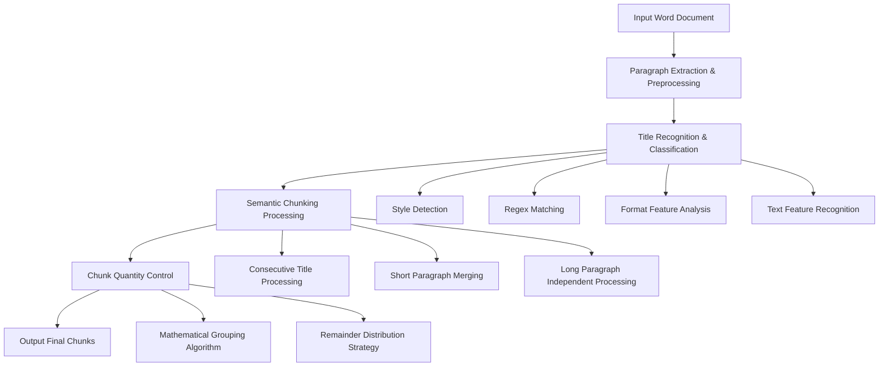

## Word Document Processing Toolkit

A comprehensive Word document processing plugin collection designed specifically for the Dify platform, providing PDF document conversion, intelligent chunking, and annotation features. Supports Chinese document processing with localized processing strategies to ensure data security.

## 🚀 Core Features

### 1. PDF to Word Converter (pdf_to_word)

- **Function Description**: Convert PDF documents to editable Word documents
- **Technical Implementation**: Based on `pdf2docx` library, supports complex layouts and format preservation
- **Supported Formats**: PDF → DOCX
- **Custom Features**: Support for custom output file names

### 2. Word Intelligent Chunker (word_chunk) ⭐

- **Function Description**: Intelligently analyze the structure of Word documents and perform reasonable document chunking based on potential headings, trying to ensure that sentence segmentation during document chunking does not cause incomplete semantic recognition by models. Note: The Word format should be as standardized as possible, and it works better for contract and legal documents.
- **Application Scenarios**: Document analysis, content extraction, knowledge management
- **Chunking Strategy**: Intelligent chunking algorithm based on paragraph semantics and document structure
- **Quantity Control**: Support for custom chunk numbers (maximum 30), with the 30-chunk limit set because iteration nodes can have at most 30 iteration objects.

### 3. Word Document Annotator (word_comment)

- **Function Description**: Add genuine native comments to Word documents
- **Technical Features**: Uses `python-docx 1.2.0` native comment API
- **Comment Features**: Precise text positioning, format preservation, support for custom commenters
- **Input Method**: JSON format comment data with flexible configuration

## 📊 Word Intelligent Chunking Algorithm Details

### Algorithm Overview

The Word intelligent chunker employs multi-level document analysis strategies, combining semantic understanding and structural recognition to achieve intelligent document segmentation.

### Core Algorithm Flow



### 1. Intelligent Title Recognition

#### Multi-dimensional Title Detection Mechanism

**Style Name Detection**

```python
# Detect Word built-in heading styles
if "heading" in style_name or "title" in style_name or "标题" in style_name:
    return True
```

**Regex Pattern Matching**

```python
patterns = [
    r"^\d+\.\d+",           # 1.1, 2.3 format
    r"^\d+\.[\s\t]*",       # 1. 2. format
    r"^[IVXLCDM]+\.",       # Roman numerals
    r"^第[\u4e00-\u9fa5\d]+[章节]", # Chapter 1, Section 2 (Chinese)
    r"^[一二三四五六七八九十百千万\d]+[\.、]", # Chinese numerals
    r"^[A-Z][A-Z\s]+\b",    # All caps titles
]
```

**Format Feature Analysis**

- **Bold Ratio Detection**: Recognize as title when more than 70% of paragraph text is bold
- **Font Size Detection**: Dynamically detect font size, recognize as title when exceeding 1.6 times the median
- **Font Type Detection**: Detect title-specific fonts like bold typefaces

### 2. Intelligent Semantic Chunking

#### Chunking Strategy Details

**Case 1: Title Processing**

```python
if is_heading:
    consecutive_title_count += 1
    if current_chunk and consecutive_title_count == 1:
        chunks.append("\n".join(current_chunk))  # Save previous chunk
        current_chunk = [text]  # New chunk starts with title
    else:
        current_chunk.append(text)  # Merge consecutive titles
```

**Case 2: Long Paragraph Processing**

```python
# Long paragraphs (≥1000 characters) become independent chunks
if len(text) >= min_length:
    if current_chunk:  # Save current chunk first
        chunks.append("\n".join(current_chunk))
    chunks.append(text)  # Long paragraph becomes independent chunk
    current_chunk = []
```

**Case 3: Short Paragraph Merging**

```python
# Merge short paragraphs into current chunk, wait for subsequent content
if len(text) < min_length and current_chunk:
    current_chunk.append(text)
```

### 3. Quantity Control Algorithm

When the number of chunks exceeds the specified limit, a mathematical grouping algorithm is used for intelligent merging:

#### Algorithm Principle

```python
total_chunks = len(chunks)  # Total number of chunks
quotient = total_chunks // max_chunks  # Quotient
remainder = total_chunks % max_chunks  # Remainder
```

#### Distribution Strategy

- **Evenly divisible**: Merge every `quotient` chunks into 1
- **Not evenly divisible**:
  - First `remainder` groups: `quotient + 1` chunks per group
  - Remaining groups: `quotient` chunks per group

**Example**: 100 chunks → 30 target chunks

- Quotient = 3, Remainder = 10
- First 10 groups: 4 chunks per group merged
- Remaining 20 groups: 3 chunks per group merged
- Final result: 10×4 + 20×3 = 100 chunks → 30 chunks

### 4. Algorithm Advantages

- **Semantic Preservation**: Chunking based on document structure and semantics, avoiding semantic fragmentation
- **Format Recognition**: Multi-dimensional title detection, adapting to various document formats
- **Intelligent Merging**: Smart merging of short paragraphs, avoiding fragmentation
- **Precise Quantity**: Mathematical grouping algorithm ensures precise chunk quantity control
- **Chinese Optimization**: Algorithm optimized for Chinese document characteristics

## 📖 Usage Guide

### PDF to Word Converter

**Basic Usage**

```python
# Input parameters
{
    "pdf_content": "<PDF file>",
    "output_filename": "converted_document"  # Optional
}

# Output
# Returns converted Word document file
```

**Features**

- Preserves original layout and formatting
- Supports table and image conversion
- Automatically handles Chinese characters
- Custom output file names

### Word Intelligent Chunker

**Basic Usage**

```python
# Input parameters
{
    "word_content": "<Word file>",
    "chunk_num": 20  # Optional, default 30, maximum 30
}

# Output JSON format
{
    "1": "First chunk content...",
    "2": "Second chunk content...",
    "3": "Third chunk content..."
    // ... up to 30 chunks
}
```

**Chunking Quality Control**

- Minimum paragraph length: 1000 characters
- Intelligent title recognition and preservation
- Semantic integrity guarantee
- Support for various document structures

### Word Document Annotator

**Basic Usage**

```python
# Input parameters
{
    "word_content": "<Word file>",
    "comments_json": {
        "target_text_1": "comment_content_1",
        "target_text_2": "comment_content_2"
    },
    "author": "commenter_name",  # Optional
    "output_filename": "annotated_document"  # Optional
}

# Output
# Returns Word document with added comments
```

**Comment Feature Highlights**

- Uses Word native comment API
- Precise text positioning and Run splitting
- Preserves original formatting and styles
- Supports table content commenting
- Automatically generates commenter abbreviations

## 🔧 Technical Architecture

### Core Technology Stack

- **Document Processing**: python-docx, pdf2docx
- **Plugin Framework**: dify_plugin
- **Logging System**: Unified logging and exception handling
- **File Processing**: Temporary file management and automatic cleanup

### Security Features

- **Local Processing**: All operations executed in local environment
- **Temporary Files**: Automatic cleanup after processing completion
- **Memory Safety**: Timely release of memory resources
- **Permission Control**: Principle of least privilege

### Performance Optimization

- **Memory Management**: Large document fragment processing
- **Algorithm Optimization**: Intelligent chunking algorithm with O(n) complexity
- **Caching Strategy**: Temporary result caching
- **Concurrent Processing**: Support for multi-document parallel processing

## 📊 Use Cases

### 1. Knowledge Management Systems

- Document import and preprocessing
- Content chunking and index establishment
- Comment and review management

### 2. Content Analysis Platforms

- Large document intelligent segmentation
- Structured data extraction
- Semantic analysis preprocessing

### 3. Collaborative Office Scenarios

- Document format conversion
- Comment and review workflows
- Version control and tracking

### 4. Automated Workflows

- Batch document processing
- Format standardization
- Content quality inspection

## 🐛 Troubleshooting

### Common Issues

**1. PDF Conversion Failure**

```
Cause: PDF file corrupted or encrypted
Solution: Check PDF file integrity, remove password protection
```

**2. Unsatisfactory Chunking Results**

```
Cause: Irregular document structure. This plugin's chunking is intended for standard format contract or policy documents
Solution: Check title formatting
```

**3. Comment Addition Failure**

```
Cause: Target text not found
Solution: Ensure target text exists in document and format matches
```

## 🚀 Changelog

### v0.0.1 (2025-01-03)

- ✨ New Feature: PDF to Word converter
- ✨ New Feature: Word intelligent chunker
- ✨ New Feature: Word document annotator
- 🔧 Optimization: Unified file processing logic
- 🔧 Optimization: Improved error handling mechanism
- 📝 Documentation: Enhanced usage guide and API documentation

---

**Developer**: czfsss  
**Version**: 0.0.1  
**Last Updated**: September 3, 2025
