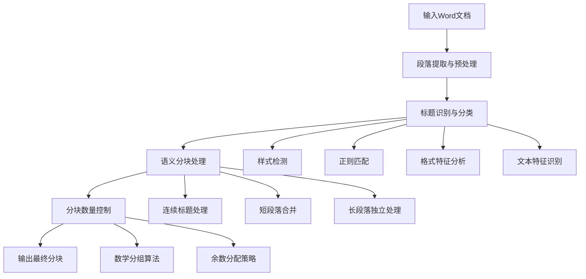

## Word 文档处理工具集

一个 Word 文档处理插件集合，专为 Dify 平台设计，提供 PDF 文档转换、智能分块和批注功能。支持中文文档处理，采用本地化处理策略，确保数据安全。

## 🚀 核心功能

### 1. PDF 转 Word 转换器 (pdf_to_word)

- **功能描述**: 将 PDF 文档转换为可编辑的 Word 文档
- **技术实现**: 基于 `pdf2docx` 库，支持复杂布局和格式保持
- **支持格式**: PDF → DOCX
- **自定义功能**: 支持自定义输出文件名

### 2. Word 智能分块器 (word_chunk) ⭐

- **功能描述**: 智能分析 Word 文档结构，按可能的标题进行合理的文档分块，尽量保证文档切分时不会导致同一句话被切割而让模型语义识别不全。注：word 格式需要尽量规范标准，针对合同类、法律类文档效果较好。
- **应用场景**: 文档分析、内容提取、知识管理
- **分块策略**: 基于段落语义和文档结构的智能分块算法
- **数量控制**: 支持自定义分块数量（最多 30 个），由于迭代节点最多只能有 30 个迭代对象，所以设置了 30 最大分块数量。

### 3. Word 文档批注器 (word_comment)

- **功能描述**: 为 Word 文档添加真正的原生批注
- **技术特色**: 使用 `python-docx 1.2.0` 原生批注 API
- **批注功能**: 精确定位文本、保持格式、支持自定义批注者
- **输入方式**: JSON 格式批注数据，灵活配置

## 📊 Word 智能分块算法详解

### 算法概述

Word 智能分块器采用多层次的文档分析策略，结合语义理解和结构识别，实现智能文档分割。

### 核心算法流程



### 1. 智能标题识别

#### 多维度标题检测机制

**样式名称检测**

```python
# 检测Word内置标题样式
if "heading" in style_name or "title" in style_name or "标题" in style_name:
    return True
```

**正则模式匹配**

```python
patterns = [
    r"^\d+\.\d+",           # 1.1, 2.3 格式
    r"^\d+\.[\s\t]*",       # 1. 2. 格式
    r"^[IVXLCDM]+\.",       # 罗马数字
    r"^第[\u4e00-\u9fa5\d]+[章节]", # 第一章、第二节
    r"^[一二三四五六七八九十百千万\d]+[\.、]", # 中文数字
    r"^[A-Z][A-Z\s]+\b",    # 全大写标题
]
```

**格式特征分析**

- **粗体比例检测**: 当段落中 70%以上的文本为粗体时识别为标题
- **字体大小检测**: 动态检测字体大小，超过中位数 1.6 倍的识别为标题
- **字体类型检测**: 检测黑体等标题专用字体

### 2. 智能语义分块

#### 分块策略详解

**情况 1: 标题处理**

```python
if is_heading:
    consecutive_title_count += 1
    if current_chunk and consecutive_title_count == 1:
        chunks.append("\n".join(current_chunk))  # 保存前一块
        current_chunk = [text]  # 新块以标题开始
    else:
        current_chunk.append(text)  # 连续标题合并
```

**情况 2: 长段落处理**

```python
# 长段落（≥1000字符）独立成块
if len(text) >= min_length:
    if current_chunk:  # 先保存当前块
        chunks.append("\n".join(current_chunk))
    chunks.append(text)  # 长段落独立成块
    current_chunk = []
```

**情况 3: 短段落合并**

```python
# 短段落合并到当前块，等待后续内容
if len(text) < min_length and current_chunk:
    current_chunk.append(text)
```

### 3. 数量控制算法

当分块数量超过指定限制时，采用数学分组算法进行智能合并：

#### 算法原理

```python
total_chunks = len(chunks)  # 总分块数
quotient = total_chunks // max_chunks  # 商
remainder = total_chunks % max_chunks  # 余数
```

#### 分配策略

- **能整除**: 每 `quotient` 个分块合并成 1 个
- **不能整除**:
  - 前 `remainder` 组：每组 `quotient + 1` 个分块
  - 剩余组：每组 `quotient` 个分块

**示例**：100 个分块 → 30 个目标分块

- 商 = 3，余数 = 10
- 前 10 组：每组 4 个分块合并
- 后 20 组：每组 3 个分块合并
- 最终：10×4 + 20×3 = 100 个分块 → 30 个分块

### 4. 算法优势

- **语义保持**: 基于文档结构和语义进行分块，避免语义割裂
- **格式识别**: 多维度标题检测，适应各种文档格式
- **智能合并**: 短段落智能合并，避免碎片化
- **数量精确**: 数学分组算法确保精确的分块数量控制
- **中文优化**: 针对中文文档特点进行算法优化

## 📖 使用指南

### PDF 转 Word 转换器

**基本用法**

```python
# 输入参数
{
    "pdf_content": "<PDF文件>",
    "output_filename": "转换后的文档"  # 可选
}

# 输出
# 返回转换后的Word文档文件
```

**功能特点**

- 保持原有排版和格式
- 支持表格、图片转换
- 自动处理中文字符
- 自定义输出文件名

### Word 智能分块器

**基本用法**

```python
# 输入参数
{
    "word_content": "<Word文件>",
    "chunk_num": 20  # 可选，默认30，最大30
}

# 输出JSON格式
{
    "1": "第一个分块内容...",
    "2": "第二个分块内容...",
    "3": "第三个分块内容..."
    // ... 最多30个分块
}
```

**分块质量控制**

- 最小段落长度：1000 字符
- 智能标题识别和保持
- 语义完整性保证
- 支持各种文档结构

### Word 文档批注器

**基本用法**

```python
# 输入参数
{
    "word_content": "<Word文件>",
    "comments_json": {
        "目标文本1": "批注内容1",
        "目标文本2": "批注内容2"
    },
    "author": "批注者姓名",  # 可选
    "output_filename": "批注版文档"  # 可选
}

# 输出
# 返回添加批注后的Word文档
```

**批注功能特色**

- 使用 Word 原生批注 API
- 精确文本定位和 Run 分割
- 保持原有格式和样式
- 支持表格内容批注
- 自动生成批注者缩写

## 🔧 技术架构

### 核心技术栈

- **文档处理**: python-docx, pdf2docx
- **插件框架**: dify_plugin
- **日志系统**: 统一日志记录和异常处理
- **文件处理**: 临时文件管理和自动清理

### 安全特性

- **本地处理**: 所有操作在本地环境执行
- **临时文件**: 处理完成后自动清理
- **内存安全**: 及时释放内存资源
- **权限控制**: 最小权限原则

### 性能优化

- **内存管理**: 大文档分片处理
- **算法优化**: 智能分块算法，O(n)复杂度
- **缓存策略**: 临时结果缓存
- **并发处理**: 支持多文档并行处理

## 📊 使用场景

### 1. 知识管理系统

- 文档导入和预处理
- 内容分块和索引建立
- 批注和评论管理

### 2. 内容分析平台

- 大型文档智能分割
- 结构化数据提取
- 语义分析预处理

### 3. 协作办公场景

- 文档格式转换
- 批注和审阅流程
- 版本控制和追踪

### 4. 自动化工作流

- 批量文档处理
- 格式标准化
- 内容质量检查

## 🐛 问题排查

### 常见问题

**1. PDF 转换失败**

```
原因：PDF文件损坏或加密
解决：检查PDF文件完整性，解除密码保护
```

**2. 分块结果不理想**

```
原因：文档结构不规范，本插件的分块本意是为了针对文档格式标准的合同类文件或制度类文件
解决：检查标题格式
```

**3. 批注添加失败**

```
原因：目标文本未找到
解决：确保目标文本在文档中存在且格式匹配
```

## 🚀 更新日志

### v0.0.1 (2025-01-03)

- ✨ 新功能：PDF 转 Word 转换器
- ✨ 新功能：Word 智能分块器
- ✨ 新功能：Word 文档批注器
- 🔧 优化：统一文件处理逻辑
- 🔧 优化：改进错误处理机制
- 📝 文档：完善使用指南和 API 文档

---

**开发者**: czfsss  
**版本**: 0.0.1  
**最后更新**: 2025 年 9 月 3 日
